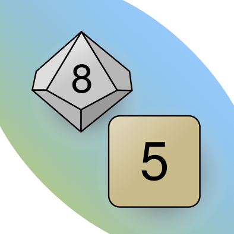

# Virtual Dice Thrower

Application to give you a many virtual dice in multiple configuration. Can be helpful with board games, giving user ability to throw their own, virtual dices. It can be also quite helpful in classic RPG games, giving a virtual dice of most popular sizes, from k4, to k100.

## What it is? Why it exist?
This is a demo app, that work as my playground in the process in learning Flutter and Dart. 

## Deploys

### Android
> Configuration: Ready

> Build: `#flutter build apk --split-per-abi`

To install locally on your phone:
- set up phone in dev-mode
- connect device to computer, with usb cable
- confirm popups
- check if Flutter see it: `#flutter doctor`
- if does not, see Flutter docs for help
- if does, in terminal, in project directory, type: `#flutter install`.

### iOS
> Configuration: Not ready

Its not prepared now, and has not been tested.

### web
> Configuration: Not ready

Its not prepared now, and has not been tested.